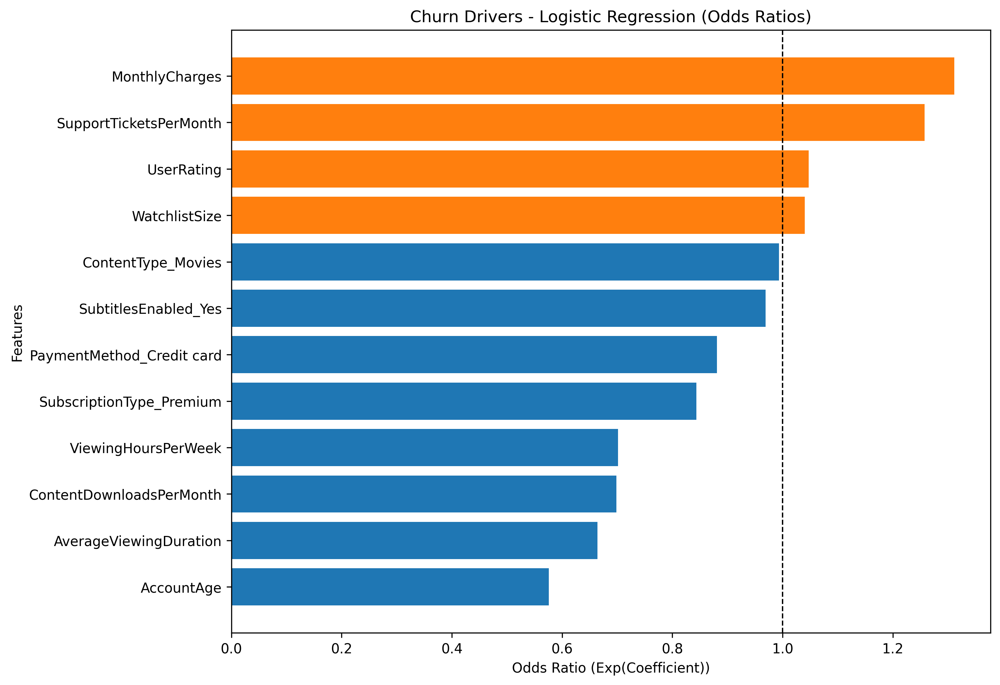
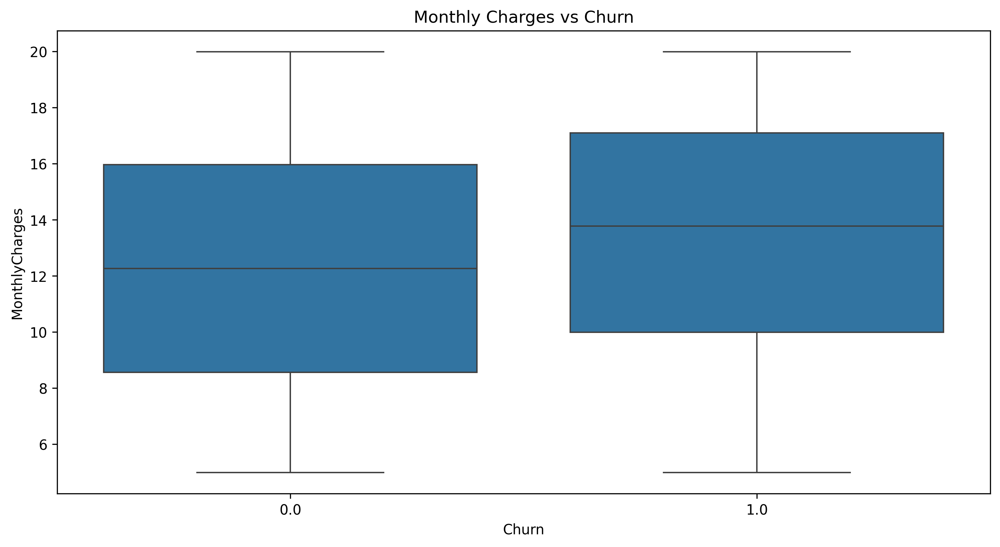
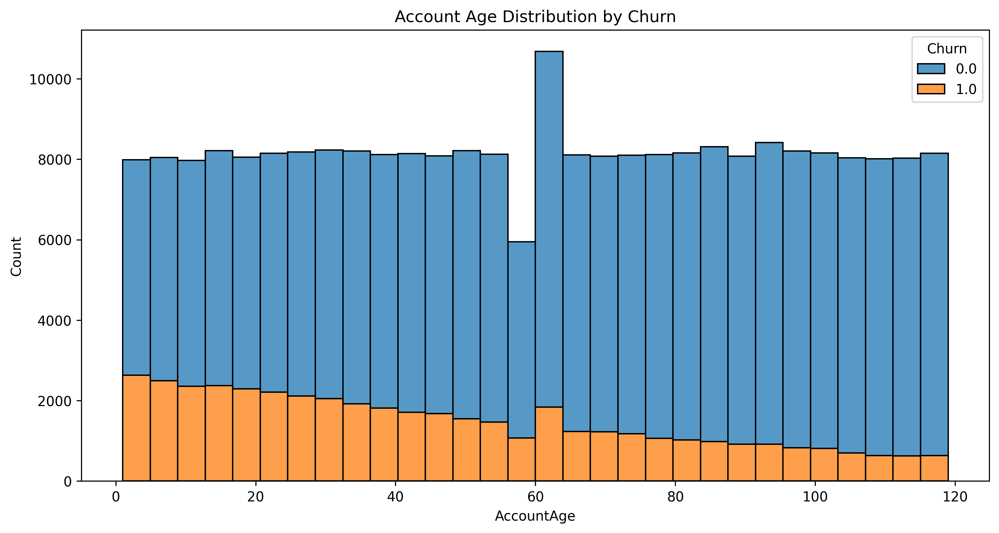
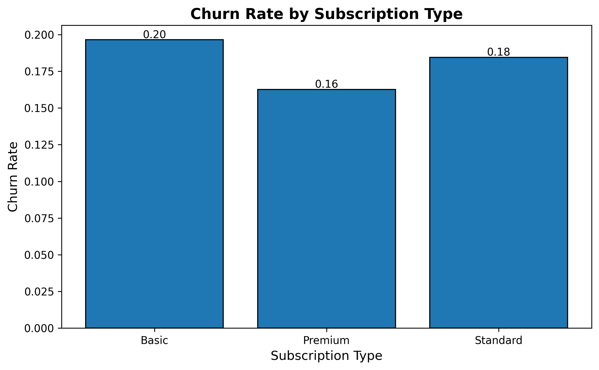
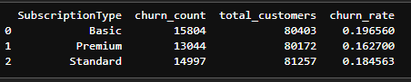
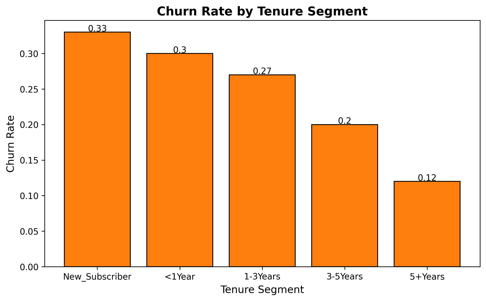
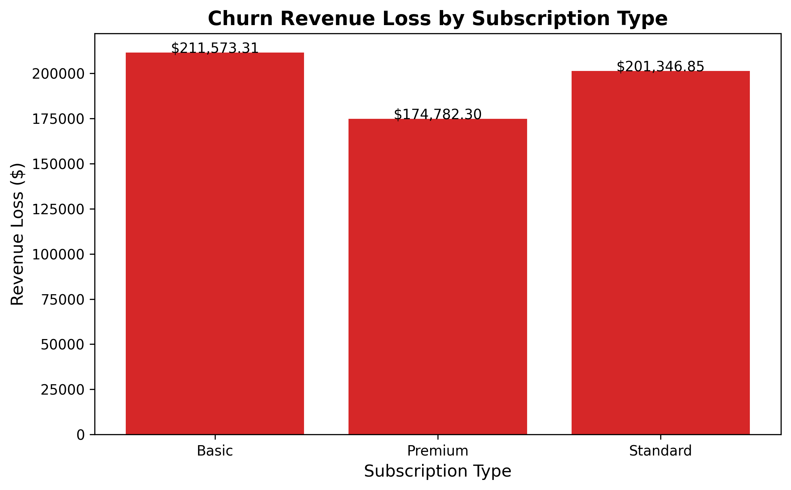

# Customer-Churn-Prediction-Project



## Project Background
What is customer churn and why it matters?
+ Churn is the rate at which customers stop using a service, and it matters because high churn directly reduces revenue, increases acquisition costs, and signals issues with customer satisfaction and loyalty.
### Business Question:
+	Why do some subscribers leave while others stay—and how can we act on it??

## Objectives
**1. Analyze customer behavior and churn trends**
+ Identify customer segments with the highest churn rates.
+	Estimate revenue loss from churn and highlight which groups contribute most to it.
+ Uncover overall behavioral patterns linked to customer retention and attrition.
  
**2.	Identify key churn and retention drivers**
+	Determine the top factors that strongly influence whether customers stay or leave.
+	Provide insights into customer behaviors that signal loyalty versus churn risk.
  
**3. Build a predictive churn model**
+	Develop and evaluate a logistic regression model using scikit-learn to predict customer churn, with performance assessed through accuracy, precision, and recall.
  
**4. Translate insights into business actions**
+	Deliver a clear, actionable report with strategies to reduce churn and improve retention.
+	Recommend targeted actions (e.g., engagement campaigns, pricing strategies, support improvements) based on findings.


## III. Executive Summary
This project was conducted to address a critical business question: Why do some subscribers leave while others stay—and how can we act on it? By analyzing customer churn behavior, we identified high-risk segments, quantified the revenue impact, uncovered the key drivers of churn, and built a predictive model to flag customers at risk.
<br>
<br>
Key findings show that **churn is concentrated** among **new/early customers** (0-20 months) and **Basic-plan users**, resulting in an **estimated revenue loss of approximately $600k**. The analysis also revealed the **top behavioral factors driving churn** such as ```MonthlyCharges```, ```SupportsTicketPerMonth```, ```WatchlistSize```, and ```UserRating```, enabling us to focus retention strategies more effectively. A **predictive churn model** was developed with **82% accuracy**, **56% precision** and **11% recall**, providing the business with a tool to identify at-risk customers efficiently. Together, these insights and tools allow for targeted interventions to reduce churn, protect revenue, and improve customer lifetime value.

## IV. Insights Deep-Dive
### Exploratory Data Analysis (EDA)
•	**Churn Count by Subscription** - Premium user(13,044) are less likely to churn than Basic(15,804) and Standard users(14,997). 


•	**Monthly Charges vs Churn** - Churned customers generally pay slightly higher ($13.4 avg. vs. non-churned = $12.3 avg.) monthly charges. 


•	**Account Age Distribution by Churn** - Higher churn in early months (0–20 months).


•	**Correlation Heatmap (Numeric Features)** - The churn correlations are weak (absolute values < 0.20), meaning churn is multi-factorial rather than driven by one numeric feature alone. No strong single predictor of churn.


### Segmentation & Analysis
<br>

<br>


**Churn rates by Subscription Type** - Premium user (16% churn rate) are less likely to churn than Basic (20%) and Standard users (18%)
<br>


**Churn Rates by Tenure Segment** - New Subscriber are the most vulnerable, churn declines steadily with tenure and rentention improves with customer longevity.

+ **New Subscribers are the most vulnerable:**
  + The churn rate is highest among New Subscribers (33%), followed by those with less than 1 year (30%).
  + This indicates that the first year is the most critical period for customer retention.

+ **Churn declines steadily with tenure:**
  + 1–3 Years: 27%
  + 3–5 Years: 20%
  + 5+ Years: only 12%
  + Customers who stay beyond 3 years are much more loyal, and the churn rate drops by nearly two-thirds compared to new subscribers.

+ **Retention improves with customer longevity:**
  + The data clearly demonstrates a loyalty effect: the longer a customer remains subscribed, the less likely they are to leave.
<br>



**Churn Revenue Loss by Subscription Type** - Basic Plan has the highest revenue loss, Standard Plan is close behind and Premium Plan has the lowest churn revenue loss.
+ **Basic Plan has the highest revenue loss:**
  + About **$211,573** in lost revenue comes from churned Basic-plan customers.
  + This suggests that although the Basic plan may have lower pricing per customer, the **high churn volume** makes it the largest contributor to revenue leakage.
    
+ **Standard Plan is close behind:**
  + Standard plan customers account for **$201,347** in churn revenue loss.
  + This indicates that mid-tier customers also churn in significant numbers, making them a crucial group to retain.

+ **Premium Plan has the lowest churn revenue loss:**
  + At **$174,782**, the Premium segment shows lower revenue loss compared to Basic and Standard.
  + This could mean Premium customers are **more loyal**, or that higher-paying customers churn less frequently.

## V. Prediction Model
+ **Preparation for Modeling:**
  + Separated ```CustomerID``` and ```Churn``` columns and used the variable names ```custid``` and ```target``` respectively.
  + Identified and made a list for **Categorical** and **Numerical** variables.
  + Transformed Categorical variables using **One-hot Encoding**.
  + Transformed and fit Numerical variables using **Standard Scaler**.
  + Merged ```custid```, ```target```, **Categorical** and **Numerical** variables into ```df_merged``` DataFrame.
  + Export to a new csv file.

+ **ML Modeling (Logistic Regression):**
  + Import **df_merged.csv** to dataFrame ```subs1``` then split data into **train** and **test**.
  + Store column names from ```subs1``` excluding ```target``` variable and ```custid```.
  + Extract **training features*** and **target**.
  + Extract **testing features*** and **target**.
  + Import the **Logistic Regression classifier**, **initialize**, and **fit** the model. 
  + Predict **churn values** on test data.
  + Print test **accuracy score**.
    
+ **Evaluation of the model:**
  + Accuracy Testing
  + Precision
  + Recall

