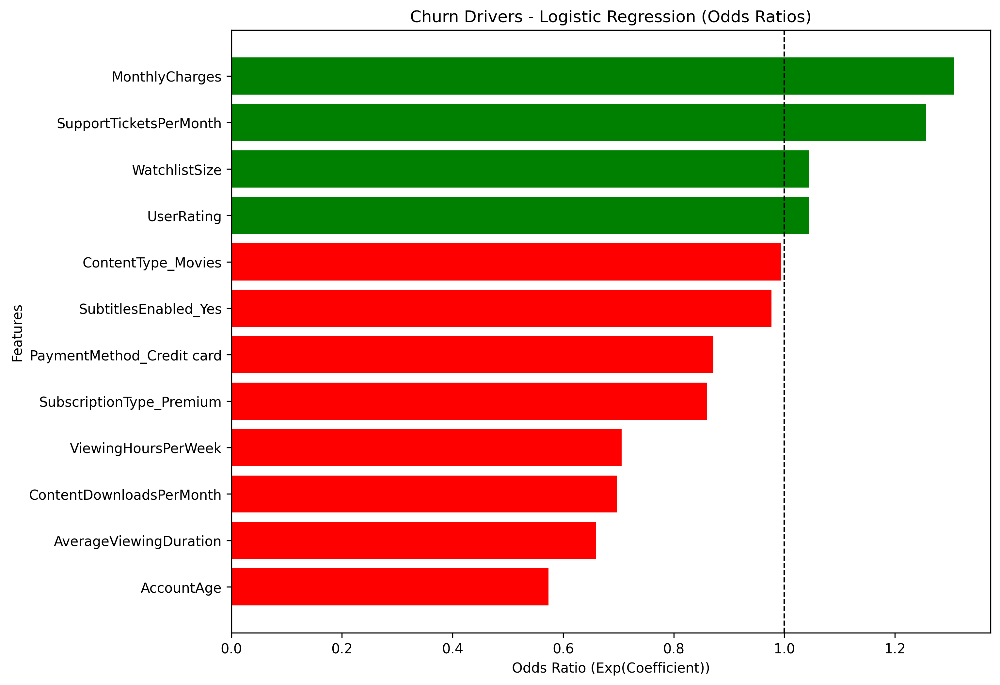

# Customer-Churn-Prediction-Project



## Project Background
What is customer churn and why it matters?
+ Churn is the rate at which customers stop using a service, and it matters because high churn directly reduces revenue, increases acquisition costs, and signals issues with customer satisfaction and loyalty.
Business Question:
+	Why do some subscribers leave while others stay—and how can we act on it??

``` print(df) ```
