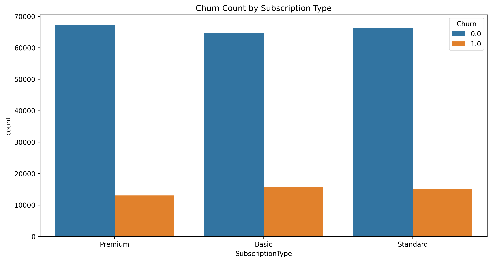
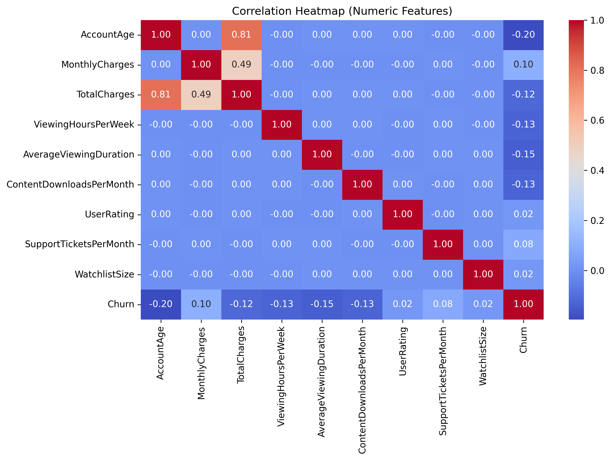
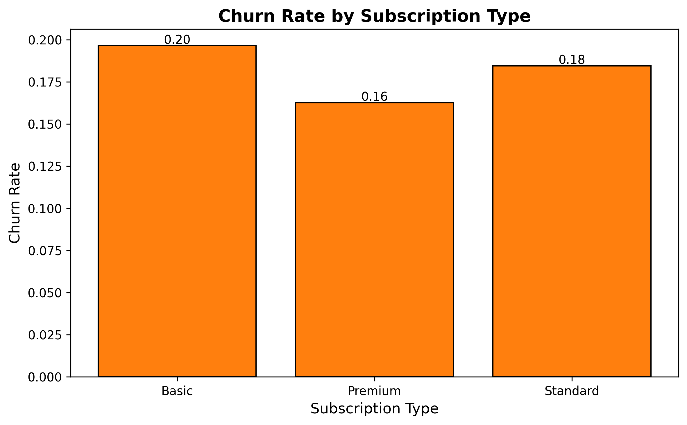

# Customer-Churn-Prediction-Project


## Project Background
What is customer churn and why it matters?
+ Churn is the rate at which customers stop using a service, and it matters because high churn directly reduces revenue, increases acquisition costs, and signals issues with customer satisfaction and loyalty.
Business Question:
+	Why do some subscribers leave while others stay—and how can we act on it??

## Objectives
**1. Analyze customer behavior and churn trends**
+ Identify customer segments with the highest churn rates.
+	Estimate revenue loss from churn and highlight which groups contribute most to it.
+ Uncover overall behavioral patterns linked to customer retention and attrition.
  
**2.	Identify key churn and retention drivers**
+	Determine the top factors that strongly influence whether customers stay or leave.
+	Provide insights into customer behaviors that signal loyalty versus churn risk.
  
**3. Build a predictive churn model**
+	Develop and evaluate a logistic regression model using scikit-learn to predict customer churn, with performance assessed through accuracy, precision, and recall.
  
**4. Translate insights into business actions**
+	Deliver a clear, actionable report with strategies to reduce churn and improve retention.
+	Recommend targeted actions (e.g., engagement campaigns, pricing strategies, support improvements) based on findings.


## III. Executive Summary
This project was conducted to address a critical business question: Why do some subscribers leave while others stay—and how can we act on it? By analyzing customer churn behavior, we identified high-risk segments, quantified the revenue impact, uncovered the key drivers of churn, and built a predictive model to flag customers at risk.
<br>
Key findings show that **churn is concentrated** among **new/early customers** (0-20 months) and **Basic-plan users**, resulting in an **estimated revenue loss of approximately $600k**. The analysis also revealed the **top behavioral factors driving churn** such as ```MonthlyCharges```, ```SupportsTicketPerMonth```, ```WatchlistSize```, and ```UserRating```, enabling us to focus retention strategies more effectively. A **predictive churn model** was developed with **82% accuracy**, **56% precision** and **11% recall**, providing the business with a tool to identify at-risk customers efficiently. Together, these insights and tools allow for targeted interventions to reduce churn, protect revenue, and improve customer lifetime value.

## IV. Insights Deep-Dive
### Exploratory Data Analysis (EDA)
•	**Churn Count by Subscription** - Premium user(13,044) are less likely to churn than Basic(15,804) and Standard users(14,997). 


•	**Monthly Charges vs Churn** - Churned customers generally pay slightly higher ($13.4 avg. vs. non-churned = $12.3 avg.) monthly charges. 


•	**Account Age Distribution by Churn** - Higher churn in early months (0–20 months).


•	**Correlation Heatmap (Numeric Features)** - The churn correlations are weak (absolute values < 0.20), meaning churn is multi-factorial rather than driven by one numeric feature alone. No strong single predictor of churn.


### Segmentation & Analysis
•	**Churn rates by Subscription Type**
<br>


•	**Churn rates by Subscription Type**
<br>


•	**Churn Rates by Tenure Segment**
<br>


•	**Churn Revenue Loss by Subscription Type**
<br>


``` print(df) ```
